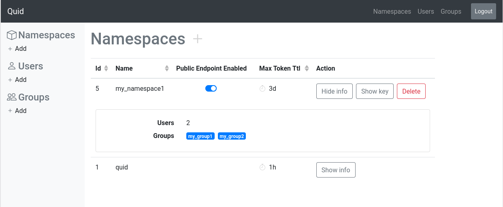

# Quid

A Json Web Tokens (JWT) server

## Install and run

Download the latest [release](https://github.com/synw/quid/releases) to run a binary or clone the repository to compile from source.

### Check PostreSQL

Quid expects PostreSQL listens to the port 5432.

You can check your PostreSQL status and the port:

```bash
$ sudo service postgresql status
$ ss -nlt | grep 5432
LISTEN  0        244            127.0.0.1:5432           0.0.0.0:*
```

### Create user and database

If you do not have already created a priviledged user, create it:

```bash
$ sudo -u postgres psql
postgres=# create user pguser with password 'my_password';
CREATE ROLE
```

Create the Quid database:

```bash
$ sudo -u postgres psql
postgres=# create database quid;
CREATE DATABASE
postgres=# GRANT ALL PRIVILEGES ON DATABASE quid to pguser;
GRANT
```

You may replace the above last statement by:

```bash
postgres=# GRANT ALL PRIVILEGES ON ALL TABLES IN SCHEMA public to pguser;
```

### Configure

1. Create the default config file:

       ./quid -conf

2. Edit the configuration file to set your database credentials:

        vim config.json

3. Initialize the database and create an admin user:

       ./quid -init

### Run

    ./quid

Go to [`localhost:8082`](http://localhost:8082) to login into the admin interface

    xdg-open http://localhost:8082



### Compile from source

    cd quidui
    npm install
    npm run build
    cd ..
    go build

[Run in dev mode](doc/dev_mode.md)

## Request tokens

Request a refresh token and use it to request access tokens

### Refresh token

A public endpoint is available to request refresh tokens for namespaces. A time to live must be provided. 
Ex: request a refresh token with a 24h lifetime `/token/refresh/24h`:

```php
curl -X POST http://localhost:8082/token/refresh/10m          \
     -H 'Content-Type: application/json'                      \
     -d '{"namespace":"my_namespace","username":"my_username","password":"my_password"}'
```

Response:

```json
{"token":"eyJhbGciOiJIUzI1NiIsInR5cCI6IzpXVCJ9..."}
```

### Access token

A public endpoint is available to request access tokens for namespaces. A time to live must be provided. 
Ex: request an access token with a 10 minutes lifetime `/token/access/10m`:

```php
curl -X POST http://localhost:8082/token/access/10m           \
     -H 'Content-Type: application/json'                      \
     -d '{"namespace":"my_namespace","refresh_token":"zpXVCJ9..."}'
```

Response:

```json
{"token":"eyJhbGciOiJIUzI1NiIsInR5cCI6IzpXVCJ9..."}
```

Note: if the requested duration exceeds the max authorized tokens time to live for the namespace the demand will be rejected

## Decode tokens

In python:

```python
payload = jwt.decode(token, key, algorithms=['HS256'])
```

Example payload:

```yaml
{
    'namespace': 'my_namespace1', 
    'name': 'my_username', 
    'groups': ['my_group1', 'my_group2'], 
    'exp': 1595950745
}
```

`exp` is the expiration timestamp in [Unix time](https://en.wikipedia.org/wiki/Unix_time) format (seconds since 1970).

See also the [python example](example/python)

## Client library

[Javascript](quidui/src/quidjs/requests.js) client library: [example](quidui/src/api.js) usage
