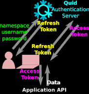

#        [](https://pkg.go.dev/github.com/teal-finance/quid) [](https://goreportcard.com/report/github.com/teal-finance/quid)


**Quid** is a [JWT][jwt] server (frontend + backend + client libraries)
to manage Administrators, Users, **Refresh Tokens** and **Access Tokens**
in independent **Namespaces** providing signature verification for the following algorithms:

- HS256 = HMAC using SHA-256
- HS384 = HMAC using SHA-384
- HS512 = HMAC using SHA-512
- RS256 = RSASSA-PKCS1-v1_5 using 2048-bits RSA key and SHA-256
- RS384 = RSASSA-PKCS1-v1_5 using 2048-bits RSA key and SHA-384
- RS512 = RSASSA-PKCS1-v1_5 using 2048-bits RSA key and SHA-512
- ES256 = ECDSA using P-256 and SHA-256
- ES384 = ECDSA using P-384 and SHA-384
- ES512 = ECDSA using P-521 and SHA-512
- EdDSA = Ed25519

[jwt]: https://wikiless.org/wiki/JSON_Web_Token "JSON Web Token"



1. First, the user logs in with **Namespace** + **Username** + **Password**.
   The **Namespace** is usually the final application name,
   represented by _Application API_ at the bottom of the previous diagram.

2. Then, the client (e.g. JS code) receives a **Refresh Token**
   that is usually valid for a few hours
   to avoid to log again during the working session.

3. The client sends this **Refresh Token** to get an **Access Token**
   that is valid for a short time,
   usually a few minutes, say 10 minutes.
   So the client must _refresh_ its **Access Token** every 10 minutes.

4. During these 10 minutes,
   the client can request the _Application API_
   with the same **Access Token**.

5. When the _Application API_ receives a request from the client,
   it checks the [JWT][jwt] signature and expiration time.
   The **Access Token** is stateless:
   the _Application API_ does not need to store any information
   about the user (the **Access Token** content is enough).

## Install

Download the latest [release](https://github.com/teal-finance/quid/releases) to run a binary or clone the repository to compile from source. See also the [Dockerfile](Dockerfile) to run **Quid** within a light container (less than 20 MB).

## Build from source

    make all -j

## Configure

1. Create the default config file:

        ./quid -conf

2. Create the `quid` database: [instructions](doc/setup_db.md)

3. Edit the configuration file to set your PostgreSQL credentials:

        vim config.json

4. Initialize the `quid` database and create the administrator user:

        ./quid -init

    These registered administrator username and password will be required to login the Administration UI.

## Run the backend

    ./quid

or simply:

    go run ./cmd/quid -dev

See also: [run in dev mode](doc/dev_mode.md)

Quid serves the static web site. Open <http://localhost:8082> to login into the admin interface:

    xdg-open http://localhost:8082


## Deploy on Heroku

[](https://heroku.com/deploy?template=https://github.com/teal-finance/quid)

## Request tokens

Request a refresh token and use it to request access tokens.

### Refresh token

A public endpoint is available to request refresh tokens for namespaces.
A time to live must be provided.

Example: request a refresh token with a 10 minutes lifetime `/token/refresh/10m`

```php
curl localhost:8082/token/refresh/10m          \
     -H 'Content-Type: application/json'       \
     -d '{"namespace":"my_namespace","username":"my_username","password":"my_password"}'
```

Response:

```json
{ "token": "eyJhbGciOiJIUzI1NiIsInR5cCI6IzpXVCJ9..." }
```

### Access token

A public endpoint is available to request access tokens for namespaces.
A time to live must be provided.

Example: request an access token with a 10 minutes lifetime `/token/access/10m`

```php
curl localhost:8082/token/access/10m           \
     -H 'Content-Type: application/json'                      \
     -d '{"namespace":"my_namespace","refresh_token":"zpXVCJ9..."}'
```

Response:

```json
{ "token": "eyJhbGciOiJIUzI1NiIsInR5cCI6IzpXVCJ9..." }
```

Note: if the requested duration exceeds the max authorized tokens time to live for the namespace the demand will be rejected

## Decode tokens

### Python

```python
import jwt

try:
    payload = jwt.decode(token, key, algorithms=['HS256'])
except jwt.ExpiredSignatureError:
    # ...
```

Payload example:

```json
{
  "usr": "jane",
  "grp": ["group1", "group2"],
  "org": ["organization1", "organization2"],
  "exp": 1595950745
}
```

Note: `"exp"` is the expiration timestamp in [Unix time](https://en.wikipedia.org/wiki/Unix_time) format (seconds since 1970).

### Examples

See the [examples](https://github.com/synw/quid_examples) for various backends.

## Client libraries

Client libraries transparently manage the requests to api servers.
If a server returns a 401 Unauthorized response when an access token is expired,
the client library will request a new access token from a Quid server,
using a refresh token, and will retry the request with the new access token.

### Javascript

[QuidJS](https://github.com/teal-finance/quidjs) : the javascript requests library.

## WebAuthn and FIDO2 features

Quid does not support WebAuthn and FIDO2.
See the following open-source projects providing these features:

- **Authelia** <https://github.com/authelia/authelia>  
  Authentication server with 2FA/SSO/OTP/FIDO2
  already supported by Traefik, Nginx, HAProxy,
  [Caddy](https://github.com/caddyserver/caddy/pull/4739)

- **Kratos** <https://github.com/ory/kratos>  
  Identity server in Go: MFA, FIDO2, social sign in, password-less, registration, account recovery…

- **WebAuthn** <https://github.com/duo-labs/webauthn>  
  WebAuthn/FIDO2 server library in Go
  (the [Python version](https://github.com/duo-labs/py_webauthn) is more active)

- **WebAuthn Demo** <https://github.com/fido-alliance/webauthn-demo>  
  WebAuthn demo in HTML and JavaScript

- **Portier** ([see the reference implementation in Rust](https://github.com/portier/portier-broker))  
  Password-less login server using email/OpenID/OAuth2/JWT,
  successor to Persona (Portier is simpler than Persona)

- Other Authentication tools in Go:  
  <https://github.com/avelino/awesome-go#authentication-and-oauth>
